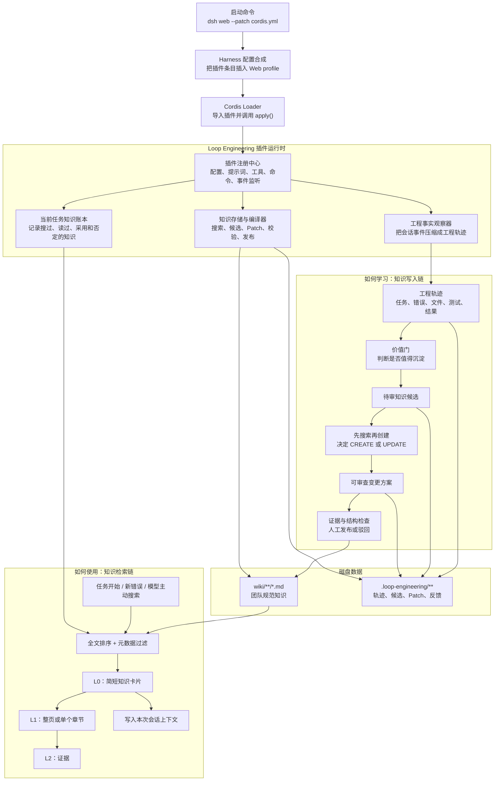
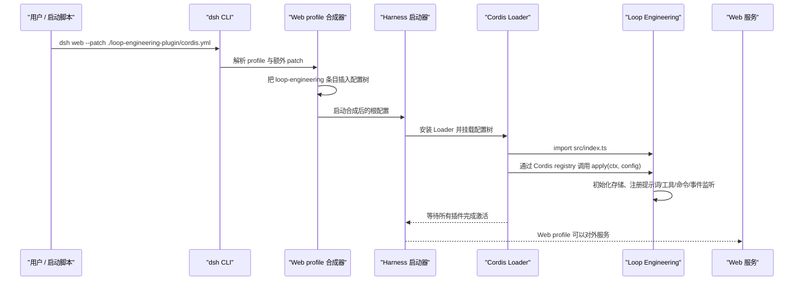

# Loop Engineering 插件底层架构与链路分析

本文面向希望理解、维护或继续扩展 `loop-engineering-plugin` 的开发者。内容以当前源码为准，并用通俗中文解释代码中的项目专用名词。文中仍会保留 TypeScript 实体名，目的只是帮助读者能在编辑器中准确搜索到对应代码。

本文围绕 PRD 提出的三个核心问题展开：

1. 如何学习：一次研发任务怎样变成可以长期维护的团队知识。
2. 如何使用：后续任务怎样在合适时机找到并逐步读取相关知识。
3. 如何便宜：怎样避免完整会话、完整 Wiki 和重复知识反复消耗上下文。

需要先说明一个边界：当前实现是跑通闭环的 MVP。它已经实现结构化轨迹、候选门控、Markdown Wiki、全文排序、渐进读取、审查命令和自动注入；PRD 中的向量检索、模型辅助提炼、Repeated Failure 专用触发器、语义 lint、反馈参与排序和专用前端知识卡片仍属于后续增强。

## 1. 整体架构图



从宏观看，插件只有两条业务主链。写入链负责“把这次任务学到的东西整理出来”，读取链负责“让未来任务在需要时找到它”。`src/index.ts` 是两条链的总调度器，`src/trace-builder.ts` 负责观察研发过程，`src/wiki-store.ts` 负责知识的读取、编译和发布，`src/text.ts` 提供统一文本规则，`src/types.ts` 定义各阶段的数据形状。

## 2. 插件何时注册：宏观启动与生命周期

### 2.1 从启动命令到插件 `apply()`



第一步是用户执行启动命令。插件自己的配置入口位于 `loop-engineering-plugin/cordis.yml`，其中 `insert` 表示把一条新插件记录插入 Harness 的 Web 配置树；`name` 指向 `src/index.ts` 的 `file:///` 地址，`config` 则是传给插件的配置。

第二步是 CLI 合成配置。`apps/cli/src/bin.ts` 中的启动分支调用 `runProfile()`；`apps/cli/src/profile-boot.ts` 中的 `composeProfile()` 依次合并内置组合包、profile 自身配置、用户配置和命令行 `--patch`。因此 Loop Engineering 不是在代码里硬编码启动，而是由 `cordis.yml` 作为最后一层覆盖插入。

第三步是创建根运行环境。`packages/boot/app-boot/src/index.ts` 中的 `boot()` 创建 Cordis `Context`，安装 Loader，然后通过 `mountRootInclude()` 挂载整个配置树。只有树中所有插件成功激活后，启动过程才算完成；任一插件导入或应用失败，`boot()` 会清理已经启动的部分并抛出带阶段信息的错误。

第四步是 Loader 导入插件。`vendor/loader/src/config/entry.ts` 中的 `Entry._init()` 根据配置里的 `name` 导入模块，`Entry._start()` 再通过 `this.ctx.registry.plugin(plugin, config, ...)` 启动它。Cordis 约定插件导出 `apply()`，所以最终进入 `loop-engineering-plugin/src/index.ts` 的 `apply(ctx, config)`。

第五步是插件注册自己的能力。`apply()` 会完成以下工作：

- 调用 `resolveConfig()` 校验比例、上限和路径，并把路径转成绝对路径。
- 创建 `WikiStore`、`TraceBuilder`、会话知识账本和强错误证据缓存。
- 调用 `ctx.systemPrompt.section()` 注册一小段常驻能力说明。
- 调用 `registerTools()` 注册 4 个模型可调用的知识工具。
- 调用 `registerCommands()` 注册 3 组用户可输入的审查命令。
- 调用 `ctx.on('session/event', ...)` 注册知识写入链观察器。
- 调用 `ctx.on('agent/pre-step', ...)` 注册自动检索和上下文注入器。

`WikiStore.initialize()` 在 `apply()` 中以后台 Promise 启动，不阻塞 Cordis 的同步注册过程。所有真正读取或写入的方法也会再次调用 `initialize()`，所以即使第一次建目录尚未结束，后续调用仍然安全。

### 2.2 运行期间发生什么

插件注册完成后平时不会主动循环扫描。它主要等待两类事件：

- 会话事件到达时，写入链提取工程事实；只有一个 turn 真正结束时才形成完整工程轨迹。
- agent（智能体）即将进入一个步骤时，读取链判断是否值得搜索历史知识；不满足条件就原样放行。

这种事件驱动方式非常重要：没有任务、没有错误、没有工具调用时，插件几乎不做工作；它不是一个持续轮询 Wiki 的后台服务。

### 2.3 停止与重新加载

插件跟随 Cordis fiber 生命周期。Web 服务停止、profile 被重新组合或插件条目被卸载时，Cordis 会释放对应 fiber，注册在该 context 下的提示词、工具、命令和事件监听随之失效。规范知识和运行状态都在磁盘上，因此进程重启不会丢失；只有当前进程内的会话知识账本和强错误缓存会重建。

## 3. 先把项目概念说成人话

### 3.1 Harness 原生执行层级：Session、Turn、Step 和 Event

在理解插件之前，需要先理解 Harness 自己怎样组织一次 agent 工作。最容易理解的层级关系是：

```text
Session（一次可持续、可恢复的会话）
└─ Turn（处理一批输入的一轮工作）
   ├─ Step 1（一次模型请求，以及该模型请求产生的工具执行）
   ├─ Step 2（模型看到工具结果后继续思考和行动）
   └─ Step N（直到本轮完成、阻塞、失败或被取消）
```

#### Session：整本可回放的工作日志

Session 可以通俗理解为“一本从第一页开始不断追加的工作日志”。对应核心实体是 `packages/core/session/src/index.ts` 中的 `Session`。它拥有稳定 ID，并把所有事件按连续 `seq` 顺序保存在仅追加日志中。恢复会话、分叉会话和重放历史都依赖这份日志，而不是依赖当前进程里某个临时对象。

`Session.append()` 是写入日志的唯一核心入口。每次追加都会验证数据能否无损保存为 JSON、分配连续序号和时间、冻结事件内容，然后同步通知 `session/event` 观察者。事件一旦进入日志就算已经提交；某个观察者报错不会把已经写入的历史撤销。

Session 不是一条聊天消息，也不是单次模型调用。用户可以在同一 Session 内连续提出任务、追加中途指令，进程也可以基于持久日志恢复该 Session。

#### Turn：处理一批输入的一轮工作

Turn 可以通俗理解为“agent 被唤醒后，为当前这批用户输入持续工作，直到得出本轮结束状态”。原生事件定义位于 `packages/core/session/src/types.ts` 的 `SessionEventMap`：

- `turn/start` 表示这一轮已经打开。
- `turn/end` 表示这一轮关闭，并携带 completed、blocked、error、aborted 等结束原因。

一个 Turn 不一定只有一次模型请求。模型可能先调用搜索工具，看到结果后继续调用文件工具，再看到测试结果后给出最终答复；这些都是同一个 Turn 中的多个 Step。反过来，如果输入在进入模型前就被拒绝或为空，也可能出现只有 `turn/start`/`turn/end`、完全没有 Step 的 Turn。

#### Step：一次模型请求加上它要求执行的工具

Step 可以通俗理解为“模型看一次上下文并作出一次响应”。对应事件是 `step/start` 和 `step/end`。一个 Step 内通常会出现：

```text
step/start
  → user/message（本步骤进入模型的新消息）
  → assistant/chunk（流式输出片段，可有多个）
  → assistant/message（组装后的助手消息）
  → tool/call（模型要求调用工具，可有多个）
  → tool/result（每个工具的执行结果）
step/end
```

如果模型在当前 Step 调用了工具，工具结果会进入会话，agent 通常会开启下一个 Step，让模型基于工具结果继续工作。`packages/core/agent-loop/src/agent.ts` 中的 `ReactLoopAgent.turn()` 负责 Turn 循环，`ReactLoopAgent.preStep()` 负责进入步骤前的准备，`ReactLoopAgent.step()` 负责真正的一次模型请求及工具处理。

#### Session Event：日志里一条不可随意改写的事实记录

Event 可以通俗理解为“工作日志中的一行结构化记录”。它不是只供 UI 展示的消息：Turn 边界、Step 边界、用户消息、模型输出、工具调用和工具结果都是事件。对应类型是 `packages/core/session/src/types.ts` 中的 `SessionEventMap` 与 `SessionEvent`。

Loop Engineering 选择观察 Event 而不是侵入模型调用，是因为 Event 已经是 Harness 可恢复、可分叉、可重放的事实主干。插件只需从中提取知识需要的字段，不需要另造一套研发过程日志。

#### 轨迹：插件从原生日志中整理出的“案件摘要”

“轨迹”不是 Harness 的原生 Session 层级，而是本插件的派生概念，对应 `EngineeringTrace`。如果 Session 是完整案卷，轨迹就是案件摘要：保留任务、关键错误、读写文件、命令、测试和最终结论，删除流式片段、重复输出和无关过程。

轨迹与 Turn 一一对应，而不是与整个 Session 一一对应。`TraceBuilder` 从 `turn/start` 开始积累当前 Turn 的事实，在 `turn/end` 时冻结为一条轨迹。这样同一 Session 内解决两个不同问题时，会得到两条独立轨迹。

### 3.2 Cordis 原生概念：Context、Plugin、Service、Fiber 和 Hook

Cordis 是 Harness 使用的插件运行时。它负责“把模块装进系统、给模块提供依赖、管理事件监听，并在卸载时自动清理”。

#### Context：插件拿到的运行环境和能力容器

`Context` 定义在 `vendor/cordis/src/context.ts`。可以把它理解为“插件的插座板”：插件通过 `ctx.tools`、`ctx.commands`、`ctx.systemPrompt` 取得其他模块提供的能力，也通过 `ctx.on()` 注册事件监听。

Context 还负责作用域。根 Context 上的贡献可以面向整个应用，agent 自己的 Context 则只影响该 agent。Loop Engineering 由 Web profile 在根插件树中加载，并给 `session/event` 与 `agent/pre-step` 监听使用 `{ global: true }` 或全局 context，因此它能观察所有 Web 会话。

#### Plugin：可以被加载和卸载的一组行为

Cordis 插件本质上是一个导出 `apply(ctx, config)` 的模块。`loop-engineering-plugin/src/index.ts` 导出 `name`、`inject`、`Config` 和 `apply()`：

- `name` 是插件稳定名称。
- `inject` 声明插件必须先获得 tools、commands、systemPrompt 服务。
- `Config` 定义并校验配置。
- `apply()` 在插件激活时注册全部行为。

“注册插件”和“插件处理任务”是两个不同阶段。`apply()` 只在插件实例激活或重新加载时运行，用来装上工具、命令和监听器；用户每发一条消息时不会重新调用 `apply()`。

#### Service、Tool 和 Command：三种不同层次的能力

Service 是插件之间共享的程序能力，例如 `ctx.tools` 是工具注册表，`ctx.commands` 是命令注册表。Tool 是注册到工具表、允许模型通过函数调用使用的能力，例如 `knowledge_search`。Command 是用户在 Web UI 输入的斜杠命令，例如 `/knowledge-review publish ...`。

因此“用户手动输入命令”和“agent 自主调用工具”不是同一机制：命令属于 UI/用户控制面，工具属于模型执行面。当前插件让模型读取和反馈知识，但把规范知识发布保留在用户可见的命令控制面。

#### Fiber：一个正在运行的插件实例及其清理边界

`Fiber` 定义在 `vendor/cordis/src/fiber.ts`。可以把它理解为“某次插件安装产生的运行实例”。它跟踪配置、依赖、监听器和清理函数。插件通过当前 Context 注册的监听、服务或其他副作用都会挂在对应 Fiber 下；插件卸载或 HMR 重启时，Fiber 负责按生命周期释放这些效果。

这解释了为什么源码里没有手工保存每个 `ctx.on()` 的取消函数：Cordis 会把监听注册记录为当前 Fiber 的 effect，Fiber dispose 时统一清理。

#### Hook：运行到某个阶段时开放给插件的扩展点

Hook 可以通俗理解为“主流程走到某个路口时，允许插件旁听或改写下一步”。Cordis 支持多种事件分发方式，定义在 `vendor/cordis/src/events.ts`：

- `emit`：同步通知所有监听者，适合广播已经发生的事实。
- `parallel`：并行执行并等待所有监听者。
- `serial`：按顺序执行并等待。
- `bail`：第一个给出结果的监听者可以提前结束。
- `waterfall`：多个监听者像洋葱一样包住主行为，每个监听者通过 `next()` 决定是否继续，并可修改下游返回值。

Loop Engineering 使用了两种原生扩展点：

- `session/event` 是事实广播。事件已经写进 Session 后，插件只能观察和派生数据，不能撤回这条事件。
- `agent/pre-step` 是 waterfall。它发生在 Step 真正开始前，监听者可以调用 `next()` 保留后续行为，再在返回的“进入步骤决定”中追加消息；如果监听者不调用 `next()`，就会截断更内层的处理，因此这类钩子必须谨慎编写。

### 3.3 原生生命周期时间线：我们的学习和使用在哪一刻发生

```mermaid
sequenceDiagram
    participant USER as "用户 / Inbox"
    participant LOOP as "ReactLoopAgent"
    participant SESSION as "Session 事件日志"
    participant USE as "知识使用链"
    participant MODEL as "模型与工具"
    participant LEARN as "知识学习链"

    USER->>LOOP: 新消息唤醒 agent
    LOOP->>SESSION: 追加 turn/start
    SESSION-->>LEARN: session/event 旁听 turn/start，建立当前轨迹

    LOOP->>USE: agent/pre-step(step=1)
    Note over USE: 任务开始检索发生在这里<br/>在模型看到消息之前
    USE-->>LOOP: 返回原消息 + 可选 L0 知识卡片

    LOOP->>SESSION: 追加 step/start
    LOOP->>SESSION: 追加 user/message（含插件知识消息）
    SESSION-->>LEARN: 旁听消息并提取任务/错误/文件
    LOOP->>MODEL: 发起模型请求
    MODEL->>SESSION: assistant/message、tool/call、tool/result
    SESSION-->>LEARN: 持续摘取命令、错误、测试和变更

    alt 工具结果出现新的强错误
        SESSION-->>USE: 暂存短错误证据
        LOOP->>SESSION: 追加 step/end
        LOOP->>USE: agent/pre-step(step=2)
        Note over USE: 强证据重新检索发生在这里<br/>仍在下一次模型请求之前
        USE-->>LOOP: 返回下一步消息 + 可选新 L0 卡片
    end

    LOOP->>SESSION: 追加最终 step/end
    LOOP->>SESSION: 追加 turn/end
    SESSION-->>LEARN: 冻结 EngineeringTrace
    Note over LEARN: 真正的自动学习判定发生在 turn/end<br/>随后异步写 trace、过价值门、生成候选和 Patch
```

按实际源码顺序，可以把关键阶段列成下表：

| 原生阶段 | Harness 正在做什么 | 本插件的“使用链” | 本插件的“学习链” |
|---|---|---|---|
| 插件激活 | Loader 导入模块并调用 `apply()` | 注册 4 个知识工具和 `agent/pre-step` 监听 | 注册 `session/event` 监听、创建 `TraceBuilder`/`WikiStore` |
| `turn/start` | `ReactLoopAgent.turn()` 打开新 Turn | 尚未搜索 | `TraceBuilder.observe()` 建立当前 Turn 累加器 |
| `agent/pre-step`, step 1 | 从 Inbox 领取消息、准备进入第一次模型请求 | 用真实用户输入执行 Task Start 检索，可能追加 L0 卡片 | 尚未生成候选 |
| `step/start` 与 `user/message` | 正式记录本步骤和模型可见的新消息 | 自动注入的知识消息也在这里进入 Session | 观察任务文字，但插件来源消息不会被当成真实任务 |
| 模型输出和工具执行 | 产生 assistant/tool 事件 | 模型可主动调用 `knowledge_search/read/related/feedback` | 持续提取错误、文件、命令、测试和最终结果 |
| `tool/result` 出现强错误 | 当前步骤获得新的具体失败证据 | 暂存错误，等下一次 `agent/pre-step` 再检索 | 把错误和测试结果写入当前轨迹累加器 |
| `agent/pre-step`, step 2+ | 模型准备基于工具结果继续 | 若有新强错误则重新搜索；没有新证据就跳过 | 仍只观察，不在每个 Step 生成候选 |
| `step/end` | 一次模型请求及其工具处理结束 | 不触发普通自动检索 | 保持累积状态，等待同一 Turn 后续 Step |
| `turn/end` | 本轮以 completed/blocked/error 等原因关闭 | 本轮自动检索结束 | 计算解决置信度、冻结轨迹、异步写盘；高价值已解决轨迹生成待审候选和 Patch |
| Turn 结束之后 | agent 回到 idle 或处理下一批输入 | 用户可在未来任务复用知识 | 用户可用 `/knowledge-candidates` 查看，再 publish/dismiss |

最关键的结论是：

- “使用知识”发生在模型请求之前。第一次使用在 Step 1 的 `agent/pre-step`，拿到新错误后的再次使用在下一 Step 的 `agent/pre-step`。
- “学习事实”贯穿整个 Turn。插件通过每一条 `session/event` 逐步收集材料。
- “形成知识候选”只发生在 `turn/end` 之后。插件不会每个 Step 都总结，也不会仅因模型说了一句话就马上发布知识。
- “正式写入 Wiki”不在 agent 原生 Turn 内自动完成，而是在用户审查后由 `/knowledge-review publish` 触发。

### 3.4 领域类型

领域类型集中定义在 `loop-engineering-plugin/src/types.ts`。可以把它们理解成一条知识从“研发现场”进入“团队手册”时经过的不同表单。

| 通俗名称 | TypeScript 实体 | 它是什么 | 是否写入磁盘 |
|---|---|---|---|
| 知识种类 | `KnowledgeType` | 规定知识是业务规则、问题模式还是架构决策 | 作为 YAML 的 `type` |
| 知识状态 | `KnowledgeLifecycle` | 表示草稿、已审、已验证、陈旧、被替代或归档 | 作为 YAML 的 `lifecycle` |
| 适用范围 | `KnowledgeScope` | 说明知识适用于哪些仓库、领域和模块 | 作为 YAML 的 `scope` |
| 知识页说明卡 | `KnowledgeMetadata` | Markdown 顶部的结构化说明，包括 ID、摘要、置信度、来源和关联知识 | YAML front matter |
| 完整知识页 | `KnowledgeUnit` | 一份已经解析的 Markdown：说明卡 + 正文 + 文件路径 + 版本 | 来源是 `wiki/**/*.md` |
| 简短知识卡片 | `KnowledgeCard` | 搜索先返回的精简结果，故意不带正文 | 临时生成，不单独保存 |
| 工程轨迹 | `EngineeringTrace` | 一次研发 turn 的压缩记录，只保留任务、错误、文件、命令、测试和结果 | `.loop-engineering/traces/*.json` |
| 待审知识 | `KnowledgeCandidate` | 系统认为“可能值得写入团队手册”的主张，还不是正式知识 | `.loop-engineering/candidates/*.json` |
| 修改方案 | `KnowledgePatch` | 明确说明准备创建/更新哪一页、改哪些章节、证据是否足够 | `.loop-engineering/patches/*.json` |
| 当前任务知识账本 | `KnowledgeWorkingSet` | 记录本次会话搜过、读过、采用或否定过哪些知识，防止重复注入 | 只在内存中 |
| 搜索筛选条件 | `SearchOptions` | 可按类型、仓库、领域、模块和数量过滤结果 | 临时参数 |

三个知识种类可以进一步这样理解：

- `problem-pattern` 是“同类故障处理手册”。它不记录某一行代码怎么改，而是记录常见症状、根因、诊断步骤、解决模式和验证办法。
- `business-rule` 是“业务不能违背的规则”。重点是为什么这样规定、有哪些例外，而不是简单复制当前代码行为。
- `architecture-decision` 是“系统为什么必须这样设计”。它保存模块边界、事实来源、否决过的方案和取舍。

### 3.5 运行时产物

规范知识与运行时产物必须区分。`wiki/` 是长期维护的团队知识真源，`.loop-engineering/` 是生成、审查和反馈过程留下的工作材料。

| 路径 | 通俗解释 | 由谁产生 | 用途 |
|---|---|---|---|
| `wiki/problem-pattern/*.md` | 故障处理手册 | `WikiStore.publish()` 或人工维护 | 后续搜索、诊断和验证 |
| `wiki/business-rule/*.md` | 业务规则手册 | `WikiStore.publish()` 或人工维护 | 约束后续实现不能违背业务语义 |
| `wiki/architecture-decision/*.md` | 架构决策记录 | `WikiStore.publish()` 或人工维护 | 解释边界、依赖方向和技术取舍 |
| `.loop-engineering/traces/*.json` | 本轮研发过程的压缩事实 | `WikiStore.writeTrace()` | 作为候选和证据的来源 |
| `.loop-engineering/candidates/*.json` | 等待人工判断的知识草案 | `WikiStore.propose()` | 给 `/knowledge-candidates` 和审查命令使用 |
| `.loop-engineering/patches/*.json` | 准备怎样修改 Wiki 的清单 | `WikiStore.propose()` | 发布前检查 CREATE/UPDATE、目标、章节、证据和 lint |
| `.loop-engineering/feedback/*.jsonl` | 知识使用后的连续评价记录 | `knowledge_feedback` 工具 | 记录有用、部分有用、无关或误导 |
| `dsh-loop.stdout.log` | Web 服务普通输出 | 后台启动脚本 | 确认服务地址和普通日志 |
| `dsh-loop.stderr.log` | Web 服务错误输出 | 后台启动脚本 | 排查加载或运行错误 |

运行时产物不是垃圾数据。轨迹、候选和 Patch 让“为什么写入这条知识”可追溯；但它们是过程材料，不应被模型当作规范知识直接引用。

### 3.6 L0、L1、L2 是什么

这三个层级只是“知识逐步展开的深度”：

- L0 是目录卡片：只告诉模型可能有哪些相关知识，包括标题、摘要、状态、置信度和版本。
- L1 是手册内容：模型选中一个 ID 后读取整页，或只读取 `Diagnosis` 等某个章节。
- L2 是证据：只有需要确认知识是否可靠时，才读取 Session、测试和评审来源标识。

这就像先看搜索结果列表，再打开某篇文章，最后才查看文章引用的原始材料。

## 4. 第一大点：如何学习——输入触发、编译与维护链路

完整链路可以简化成：

```text
研发活动
  → 触发输入
  → 摘取工程事实
  → 形成工程轨迹
  → 判断是否值得沉淀
  → 生成待审知识
  → 先查已有 Wiki
  → 生成 CREATE/UPDATE 修改方案
  → 验证证据和结构
  → 人工发布或驳回
  → 写入规范 Markdown
```

### 4.1 输入如何触发

有两种触发方式。

第一种是自动触发。用户正常让 agent 排查、修改和验证代码，不需要额外输入知识命令。`loop-engineering-plugin/src/index.ts` 中的 `ctx.on('session/event', ...)` 会旁路观察所有会话事件；当 `TraceBuilder.observe()` 在 `turn/end` 返回完整轨迹后，代码先保存轨迹，再调用 `worthDistilling()` 判断是否值得生成候选。

第二种是手动触发。用户在 Web UI 输入 `/save-knowledge type | title | summary | aliases | triggers`。`loop-engineering-plugin/src/index.ts` 的 `registerCommands()` 注册该命令，处理器优先取得 `TraceBuilder.latest(sessionId)` 返回的最近完整轨迹；如果当前会话没有完整轨迹，则用 `emptyExplicitTrace()` 生成明确标记为“未解决”的占位记录。手动保存可以要求系统生成候选，但不能绕过证据检查、结构检查和人工发布。

当前 MVP 不会让模型偷偷执行发布命令。模型可以主动调用只读知识工具，但规范知识写入必须经过用户可见的斜杠命令或自动生成待审候选，最后再由用户执行 `publish`。

### 4.2 怎样从会话里摘取工程事实

对应文件是 `loop-engineering-plugin/src/trace-builder.ts`，核心实体是 `TraceBuilder` 和内部累加器 `MutableTrace`。

可以把 `TraceBuilder` 理解为会议记录员：它不保存会议逐字稿，只在事件到达时记下有工程价值的事实。

- 收到 `user/message`：把第一条真实用户消息记为任务；如果用户说“已解决”“works now”等，再记为确认信号。
- 收到 `assistant/message`：保存最后一段解决总结，作为可能的根因和方案描述。
- 收到 `tool/call`：记下调用了什么工具、参数中出现哪些文件；如果工具是 `apply_patch` 等修改工具，就标记发生过变更。
- 收到 `tool/result`：记下对应命令的简短结果，提取错误片段、测试文件名和 pass/fail 状态。
- 收到 `turn/end`：把 Set/Map 展开成可序列化数组，计算解决置信度，并产出 `EngineeringTrace`。

辅助实体也都在同一文件：`PATH` 识别文件路径，`ERROR` 识别中英文错误，`PASS`/`FAIL` 识别测试结论，`detectTest()` 归一测试结果，`collectPaths()` 统一 Windows 和 POSIX 路径分隔符。

### 4.3 怎样判断任务真的解决了

对应实体是 `loop-engineering-plugin/src/trace-builder.ts` 中的 `resolutionScore()`。

它不是让模型凭感觉判断，而是使用容易解释的加减分：turn 正常完成先给基础分；发生修改、测试通过、用户确认和最终总结包含“修复/完成/通过”等词会加分；测试失败则强力扣分。结果限制在 0 到 1 之间，达到 `0.65` 才把 `resolved` 设为 true。

因此 `turn/end` 只表示这一轮结束，不等于问题已经解决。比如 agent 最后仍有失败测试，即使正常回复了用户，也很难通过解决门槛。

### 4.4 怎样判断是否值得沉淀

对应实体是 `loop-engineering-plugin/src/trace-builder.ts` 中的 `worthDistilling()`，配置门槛来自 `loop-engineering-plugin/cordis.yml` 的 `autoCandidateThreshold`。

它依次检查三件事：

1. 任务必须已经解决，且置信度达到配置阈值。
2. 轨迹里必须有错误，或者用户任务明确包含业务规则、禁止事项、架构等高价值语义。
3. 必须至少有文件变更、测试、用户确认等工程证据之一。

所以改颜色、翻译、普通语法解释等任务不会自动产生候选。当前 MVP 的“价值判断”是低成本启发式规则，不会调用额外模型。

### 4.5 怎样从工程轨迹整理出待审知识

对应文件是 `loop-engineering-plugin/src/wiki-store.ts`，核心实体是 `distill()`。

可以把它理解为“按固定表格整理”。它先通过 `parseExplicit()` 解析用户手动填写的竖线参数；没有指定类型时，`inferType()` 根据业务/架构关键词判断，默认使用问题模式；没有标题时，`inferTitle()` 优先用第一条错误，否则用任务开头。

然后 `distill()` 按知识类型填固定章节：问题模式填写 Problem、Symptoms、Root Cause、Diagnosis、Solution Pattern、Verification 等；业务规则填写 Rule、Exceptions、Reason、Evidence；架构决策填写 Decision、Context、Rejected Alternatives、Trade-offs、Evidence。

输出实体是 `KnowledgeCandidate`。它表达的是“系统认为可能存在这样一条知识”，不是最终事实。当前实现是确定性模板提炼，并没有调用 LLM；这与 PRD 的最终设想相比更便宜、更可测试，但抽象能力也更有限。

### 4.6 怎样避免同一问题越写越多

对应实体是 `loop-engineering-plugin/src/wiki-store.ts` 中的 `WikiStore.propose()` 和 `WikiStore.search()`。

候选形成后，`propose()` 先用候选标题、摘要和触发词搜索现有 Wiki。如果最高相关知识达到 `duplicateThreshold`，目标就是已有知识 ID，Patch 操作设为 `update`；否则生成新的规范 ID，操作设为 `create`。

搜索由 `WikiStore.search()` 完成。它调用 `searchDocument()` 将标题、摘要、别名、触发词、范围和正文编译成 token 统计；标题、摘要和别名被重复放入加权文本，相当于告诉排序器这些字段更重要。随后使用 BM25 风格公式计算词频、稀有度和文档长度影响，再叠加生命周期和置信度。

当前 MVP 在此只真正生成 `CREATE` 和 `UPDATE`。PRD 中的 `MERGE`、`LINK`、`CONFLICT`、`IGNORE` 是 `KnowledgePatch.operation` 已预留但尚未形成完整决策逻辑的增强方向。

### 4.7 怎样生成可审查修改方案

对应实体是 `loop-engineering-plugin/src/wiki-store.ts` 中的 `KnowledgePatch` 构造和 `patchChanges()`。

Patch 会写明：候选 ID、操作类型、目标知识 ID、每个章节准备 set 还是 append、证据、置信度、验证等级、结构 lint 错误和创建时间。更新已有知识时，`Known Occurrences` 与 `Evidence` 使用追加语义，其他章节保持结构化 set 描述。

模型不会直接拿到 Markdown 文件覆盖权限。即使候选文本来自模型或用户，真正修改文件的仍是确定性代码。这保证了同样的候选得到稳定的变更，也让审查者能够先看 Patch 再决定是否发布。

### 4.8 怎样检查证据和结构

证据分级对应 `loop-engineering-plugin/src/wiki-store.ts` 中的 `verifyCandidate()`。

- 证据少于两项时是 `UNSUPPORTED`。
- 未解决的问题模式是 `PARTIALLY_SUPPORTED`。
- 有通过测试的问题模式是 `SUPPORTED`。
- 其他类型根据轨迹置信度得到 `SUPPORTED` 或 `PARTIALLY_SUPPORTED`。

候选结构检查对应 `structuralLintCandidate()`，它检查类型、标题长度、摘要长度、证据和置信度。最终页面检查对应 `structuralLintUnit()`，它检查 ID 前缀、来源和固定必需章节。

当前 MVP 没有单独的模型语义 lint，也不会自动发现两条业务规则在语义上互相冲突；PRD 中的 Semantic Lint 与 `CONFLICTING` 深度判定仍需后续实现。

### 4.9 用户怎样审查、发布或驳回

对应文件是 `loop-engineering-plugin/src/index.ts` 的 `registerCommands()`。

用户输入 `/knowledge-candidates` 时，命令处理器调用 `WikiStore.pending()`，把每个待审候选和对应 Patch 配对显示。用户复制候选 ID 后有两种选择：

- `/knowledge-review dismiss <candidate-id>` 调用 `WikiStore.dismiss()`，只把候选状态改成 `dismissed`，完全不修改 `wiki/`。
- `/knowledge-review publish <candidate-id>` 调用 `WikiStore.publish()`，重新检查候选状态、证据等级、lint 和最终页面结构，然后才写入 Markdown。

`WikiStore.publish()` 使用 `unitFromCandidate()` 创建新知识，或使用 `updateUnit()` 合并已有知识。更新逻辑不会粗暴覆盖已有根因和方案，只累积别名、触发词、来源、出现记录和证据，并适度提高置信度。

最终写入由 `atomicWrite()` 完成：先在同一目录写临时文件，再通过 `rename()` 替换正式文件。即使进程在写入中途退出，旧知识页仍然完整，不会留下半个 YAML 或半篇 Markdown。

### 4.10 知识怎样长期维护

规范知识由 `WikiStore.serializeUnit()` 写为 Markdown + YAML。元数据实体是 `KnowledgeMetadata`，正文结构由知识类型决定。

生命周期包括 `draft`、`reviewed`、`verified`、`stale`、`superseded` 和 `archived`。当前创建逻辑中，高置信度问题模式可以成为 `verified`，业务规则和架构决策默认成为 `reviewed`；`stale`、`superseded`、`archived` 目前主要支持人工维护和检索过滤，尚无自动陈旧检测器。

## 5. 第二大点：如何使用——检索触发、导航与上下文组装

完整链路可以简化成：

```text
用户提出任务 / 工具出现新错误 / 模型主动搜索
  → 判断是否值得检索
  → 提取短查询
  → 全文搜索与元数据过滤
  → 返回 L0 卡片
  → 模型选择一个知识
  → 读取 L1 整页或章节
  → 必要时读取 L2 证据
  → 记录本次会话已搜、已读和反馈
```

### 5.1 有哪些方式触发检索

当前 MVP 有三种实际触发方式。

第一种是任务开始自动检索。用户输入包含错误、Bug、架构、业务规则、状态、刷新、依赖、修改或实现等工程信号时，`loop-engineering-plugin/src/index.ts` 的 `ctx.on('agent/pre-step', ...)` 在第一个步骤读取真实用户消息并尝试搜索。用户不需要手动输入工具名。

第二种是出现新的强错误证据后自动检索。当工具结果包含 error、failed、undefined、错误、失败等词时，`ctx.on('session/event', ...)` 把短错误片段放进 `strongEvidence`；agent 进入下一步骤时，`agent/pre-step` 用这段错误再次搜索。这样一开始描述模糊的任务，在拿到具体错误后还有一次重新匹配机会。

第三种是模型主动调用工具。模型判断当前任务可能受历史业务规则、问题模式或架构决策影响时，可以调用 `knowledge_search`；用户也可以在 Web UI 明确要求模型“调用 knowledge_search 搜索某个症状”。该工具由 `registerTools()` 注册。

PRD 还设计了 Repeated Failure 专用触发器。当前实现没有单独统计相同错误、相同测试失败或相似工具重试次数；它只能把每次新出现的强错误证据作为下一步检索信号。

### 5.2 哪些输入会被明确跳过

对应实体是 `loop-engineering-plugin/src/index.ts` 中的 `retrievalWorthwhile()`。

它先拒绝长度小于 12 的短输入，再拒绝以格式化、翻译、改颜色/文案、解释 API/语法开头的低价值任务，最后要求文本包含工程问题或规则架构信号。除此之外，以下情况也会在 `agent/pre-step` 直接跳过：

- 配置关闭 `automaticRetrieval`。
- 下游决定不进入当前步骤。
- 本会话达到 `maxAutomaticRetrievalsPerTask`。
- 相同 query 哈希已经搜索过。
- 搜索没有结果。
- 结果知识已经读取过或被负面反馈否定。

这就是检索门。它的目标不是尽量多搜，而是在“可能真的有团队知识价值”时才搜。

### 5.3 查询文本怎样形成

任务开始时，`agent/pre-step` 只挑选 `message.source.kind === 'user'` 的真实用户消息，再用 `contentText()` 提取文本并合并。插件自己先前注入的消息不会成为下一次 query，从而避免知识搜索自己触发自己。

出现新错误时，查询来自工具结果中最多 300 字符的错误片段，而不是完整命令输出。`loop-engineering-plugin/src/text.ts` 的 `contentText()` 能从 Harness 内容块中递归提取文字，同时忽略图片、音频和未知块。

PRD 中完整的 `TaskContext` 还包括实体、错误码、文件、模块、领域和症状等独立字段。当前 MVP 没有单独构建 `TaskContext` 实体，而是直接使用用户文本或错误片段作为全文查询；文件、模块范围主要在知识写入时从轨迹中提取。

### 5.4 搜索怎样工作

入口是模型工具 `knowledge_search`，实现位于 `loop-engineering-plugin/src/index.ts` 的 `registerTools()`；真正排序位于 `loop-engineering-plugin/src/wiki-store.ts` 的 `WikiStore.search()`。

工具接收 `query`、可选 `type` 和可选 `limit`。`optionalKnowledgeType()` 拒绝拼错的类型，`integerLimit()` 保证数量是正整数且不超过部署上限。

`WikiStore.search()` 每次从 Markdown 重新构建轻量索引。`loop-engineering-plugin/src/text.ts` 的 `tokenize()` 会拆 camelCase、路径、下划线和标点，过滤中英文常见停用词，并对较长中文连续词生成相邻二元词，所以“刷新后用户状态为空”能召回英文标题的 hydration 相关知识，只要 triggers/正文中含有对应中文表达。

当前检索是全文/BM25 风格加元数据过滤，不包含 embedding 向量搜索。`SearchOptions` 已支持知识类型、仓库、领域、模块和数量，但对外 `knowledge_search` MVP 只暴露了类型与数量；repo/domain/module 过滤尚未出现在工具 schema 中。

### 5.5 排序为什么不只看关键词

`WikiStore.search()` 先计算文本相关度，再乘生命周期与置信度权重。`verified` 权重最高，`stale` 明显降权，其他状态居中；高置信度知识也会获得更高排序。最后把当前结果集的相关度归一化为 0 到 1，并按相关度、置信度排序。

PRD 期望未来还综合 scope match、最近验证时间和历史反馈。目前 scope 只用于硬过滤，反馈不会参与排序，`last_verified_at` 也没有额外新鲜度公式。

### 5.6 为什么第一次只返回简短卡片

对应实体是 `KnowledgeCard`、`cardOf()` 和 `renderCard()`。

`cardOf()` 从完整 `KnowledgeUnit` 中只投影 ID、标题、类型、摘要、范围、生命周期、置信度、相关度和版本，不带 `body`。`renderCard()` 再把它格式化成受 `maxCardChars` 限制的 L0 文本。

这意味着自动检索即使返回 5 条知识，也只是 5 张目录卡片，而不是 5 篇完整手册。模型先判断相关性，再决定是否继续读取。

### 5.7 模型怎样读取整页、章节和证据

对应工具是 `knowledge_read`，注册于 `loop-engineering-plugin/src/index.ts`，底层调用 `loop-engineering-plugin/src/wiki-store.ts` 的 `WikiStore.read()`。

有三种读取方式：

- 只提供 `id`：返回该知识的完整 Markdown 正文，即 L1 整页。
- 提供 `id + section`：`extractSection()` 按二级标题只取指定章节，例如只读 `Diagnosis`，仍属于 L1。
- 提供 `id + layer=evidence`：只返回 `Evidence` 章节，即 L2。

如果 ID 不存在、章节不存在或 layer 拼错，工具会明确报错，不会返回空内容让模型误判。

### 5.8 模型怎样沿知识关系继续导航

对应工具是 `knowledge_related`，底层调用 `WikiStore.related()`。

规范 Markdown 的 front matter 中有 `related` ID 数组。`related()` 读取这些邻居 ID，在当前 Wiki 中找到对应页面，并仍然只返回 L0 卡片。它不会因为一页关联了两页就把两篇正文自动塞进上下文。

这是一种显式知识图导航。当前图完全由 Markdown 元数据维护，没有单独图数据库，也不会自动推断隐含关系。

### 5.9 当前任务怎样避免重复读取

对应实体是 `KnowledgeWorkingSet` 和 `loop-engineering-plugin/src/index.ts` 中的 `workingSetFor()`。

可以把它理解为当前任务的一张知识使用清单：

- `searches` 保存已经自动执行过的 query 哈希。
- `candidates` 保存搜索返回过的 L0 ID。
- `loaded` 保存已经用 `knowledge_read` 展开的 ID。
- `used` 保存收到正面反馈的 ID。
- `dismissed` 保存收到无关或误导反馈的 ID。
- `automaticRetrievals` 记录自动检索次数。

自动检索前会过滤 `loaded` 和 `dismissed`。因此同一知识一旦已经读过，或用户/模型已经说它无关，就不会在当前会话里再次自动注入；显式调用工具仍然允许重新查看。

工作集当前只存在内存中。进程重启后它不会从 Session Event 重建；PRD 中把工作集完整持久化并支持恢复/分叉一致性仍有扩展空间。

### 5.10 知识怎样进入模型上下文

对应实体是 `renderAutomaticContext()`、`createUserMessage()` 和 `agent/pre-step` 返回值。

检索到卡片后，插件组装一段以 `Team Knowledge (task-start; L0 cards only)` 或 `Team Knowledge (strong-evidence; L0 cards only)` 开头的文字，并明确提醒模型“历史团队知识不是当前运行时事实，使用前应读取并验证”。

这段文字通过 `createUserMessage()` 创建，来源标记为 `{ kind: 'plugin', plugin: 'loop-engineering' }`，再追加到当前 step 的 `decision.messages`。Harness 随后会把它作为模型可见消息进入会话事件，因此不是不可追踪的隐藏字符串。

PRD 设想了独立的 `KnowledgeContextInjected` 事件，包含每个知识 ID、版本、触发器和投影哈希。当前 MVP 把这些信息编码在插件来源消息的可见文本中，并未声明独立事件类型。

### 5.11 使用结果怎样反馈

对应工具是 `knowledge_feedback`，实现位于 `registerTools()`。

模型或用户可以记录 `helpful`、`partially-helpful`、`irrelevant` 或 `misleading`，以及可选说明。每次评价都作为一行 JSON 追加到 `.loop-engineering/feedback/<knowledge-id>.jsonl`，不会覆盖历史记录。

正面反馈把 ID 放进工作集 `used`，负面反馈放进 `dismissed`，立即影响当前会话的自动注入。目前这些 JSONL 还没有汇总为长期 Helpful Rate，也没有参与下次搜索排序或自动触发知识重新验证。

## 6. 第三大点：如何便宜——低成本知识闭环

Token 控制不是单独一个函数，而是贯穿写入链和读取链的多道减法。原则是：不把没必要的信息交给模型。

### 6.1 不把完整会话交给知识编译

对应实体是 `TraceBuilder.observe()` 和 `EngineeringTrace`。

插件监听完整事件，但只保存任务、错误、文件、命令摘要、测试、确认和最终结果。工具输出限制长度，错误片段去重，文件和确认使用 Set。几十轮 read/grep/bash 的完整文本不会直接进入候选。

当前 `distill()` 又是确定性模板，因此连压缩后的 trace 都不需要再次发送给一个提炼模型。这比 PRD 的 LLM Distiller 更省 Token，但也少了跨多次复杂任务做深层语义抽象的能力。

### 6.2 普通任务不进入知识编译

对应实体是 `worthDistilling()` 和 `autoCandidateThreshold`。

只有任务已解决、置信度达标、具备错误或规则/架构信号，并且至少有工程证据时才自动生成候选。其他 turn 最多写一份紧凑 trace，不执行 Search Before Create 和候选编译。

### 6.3 先查已有知识，不读整个 Wiki

对应实体是 `WikiStore.propose()` 和 `WikiStore.search()`。

候选只携带标题、摘要和触发词去搜索前几条相关知识，而不是把全部 Markdown 交给模型。当前实现连“编译器判断更新目标”也用确定性相关度阈值完成，不产生额外模型调用。

### 6.4 只生成小 Patch，不重写整页

对应实体是 `KnowledgePatch`、`patchChanges()`、`unitFromCandidate()` 和 `updateUnit()`。

当同一问题再次出现时，系统只追加新的来源、出现记录和证据，并更新少量元数据。它不会把旧的 3000 字知识页和新证据一起交给模型重写，从而同时减少输入、输出和误覆盖风险。

### 6.5 先给结论卡片，需要时再看证据

对应实体是 `KnowledgeCard`、`knowledge_read` 和 `WikiStore.read()`。

自动检索只返回 L0；模型确认相关后读取 L1；只有怀疑或需要证明时才读取 L2。`section` 参数还能只取 Diagnosis、Verification 等一个章节。这是读取链最大的上下文节省来源。

### 6.6 同一个任务不重复付费

对应实体是 `KnowledgeWorkingSet`。

同样的 query 用 `contentVersion()` 形成稳定哈希并只自动搜索一次；已读取和已否定知识不会再次自动注入；`maxAutomaticRetrievalsPerTask` 再设置硬上限。即使 agent 有很多 step，也不会每一步都自动搜索和重复塞入同一页面。

### 6.7 只在事件出现时检索

对应实体是两个事件钩子：`session/event` 负责捕获强错误，`agent/pre-step` 负责在任务开始或新错误后检索。

当前实现明确禁止 every-step 检索。没有新任务文本、没有新错误证据、相同 query 已搜或已达预算时，钩子原样返回下游决定。

### 6.8 常驻提示词只声明能力

对应实体是 `loop-engineering-plugin/src/index.ts` 中的 `ctx.systemPrompt.section()`。

常驻系统提示词只有一小段：告诉模型存在团队工程知识、何时应该搜索、先看卡片再读详情、陈旧知识只能作为线索。真实 Wiki 不常驻系统提示词，而是通过工具或插件消息按需进入上下文。

### 6.9 用字符预算做硬保护

对应配置是 `maxCardChars` 和 `maxContextChars`，辅助实体是 `loop-engineering-plugin/src/text.ts` 的 `boundText()`。

每张卡片先限制字符数，自动组装的全部知识上下文再限制总字符数，超出后添加 `...[truncated]`。这不是精确 token 计数，但计算几乎免费，足以防止异常长标题、摘要或范围撑爆一次注入。

当前实现尚未统计 PRD 中的 `Loop Token Overhead`，也没有为 L1/L2 分别维护精确 token 预算；这些需要接入 Harness token meter 后才能形成可观测指标。

## 7. 两个端到端例子

### 7.1 第一次解决冷启动状态丢失

用户正常输入“刷新后用户状态变成 undefined，请排查并修复”。任务开始时插件可能先从已有 Wiki 搜 L0；如果没有知识，agent 继续排查。会话中 `TraceBuilder` 记录 undefined 错误、读取/修改文件和测试结果。turn 结束且测试通过后，`worthDistilling()` 允许继续，`distill()` 生成问题模式候选，`propose()` 搜索 Wiki 后决定 CREATE，生成 Patch。用户通过 `/knowledge-candidates` 查看，再执行 `/knowledge-review publish ...`，最终由 `WikiStore.publish()` 写入 `wiki/problem-pattern/problem.persisted-state-hydration-race.md`。

### 7.2 第二次遇到不同描述的同类问题

另一个会话输入“浏览器重载后登录看起来丢了”。`agent/pre-step` 用用户文本搜索，`tokenize()` 的中文切分和知识 triggers 让它召回 hydration 问题模式，只注入 L0 卡片。agent 判断相关后调用 `knowledge_read` 读取 Diagnosis，必要时再读 Evidence。修复完成后又产生候选；`propose()` 搜到已有页面且相关度超过阈值，于是生成 UPDATE。发布时 `updateUnit()` 把第二次 Session、测试和 Known Occurrence 追加到同一页，而不是创建第二篇重复 Bug 日志。

## 8. 当前实现与 PRD 目标对照

| PRD 能力 | 当前 MVP 状态 | 对应源码或说明 |
|---|---|---|
| Session → Structured Trace | 已实现 | `src/trace-builder.ts`：`TraceBuilder` |
| Resolution Detector | 已实现启发式版本 | `resolutionScore()` |
| Candidate Gate | 已实现启发式版本 | `worthDistilling()` |
| LLM Knowledge Distiller | 当前为确定性模板，不调用 LLM | `src/wiki-store.ts`：`distill()` |
| Search Before Create | 已实现 CREATE/UPDATE | `WikiStore.propose()` |
| Knowledge Patch | 已实现 JSON Patch 描述 | `KnowledgePatch`、`patchChanges()` |
| Evidence Verification | 已实现规则式分级 | `verifyCandidate()` |
| Structural Lint | 已实现 | `structuralLintCandidate()`、`structuralLintUnit()` |
| Semantic Lint / Conflict | 尚未完整实现 | 类型已预留 `CONFLICTING`，无语义判定器 |
| 风险分级审查 | 通过斜杠命令人工审查 | `registerCommands()` |
| Task Start Retrieval | 已实现 | `agent/pre-step` 的 step 1 分支 |
| Strong Evidence Retrieval | 已实现 | `strongEvidence` + `agent/pre-step` |
| Repeated Failure Retrieval | 尚无独立计数器 | 后续需跟踪重复错误/测试/工具调用 |
| Agent Manual Retrieval | 已实现 | 4 个 `knowledge_*` 工具 |
| FTS/BM25 + Metadata | 已实现 | `WikiStore.search()` |
| Embedding Semantic Search | 未实现 | 后续 provider/index 增强 |
| L0/L1/L2 | 已实现 | `KnowledgeCard`、`WikiStore.read()` |
| Section-level Read | 已实现 | `extractSection()` |
| Knowledge Working Set | 已实现进程内版本 | `KnowledgeWorkingSet`、`workingSetFor()` |
| 模型可见知识进入 Session | 以插件来源消息实现 | `createUserMessage()` |
| 独立 KnowledgeContextInjected 事件 | 未实现 | 当前信息在消息文本中 |
| Knowledge Feedback | 已实现记录和当前会话抑制 | `knowledge_feedback`、JSONL |
| 反馈参与长期排序/重新验证 | 未实现 | 后续需反馈聚合器 |
| 专用 Review UI 卡片 | 当前为 Web UI 斜杠命令 | `/knowledge-candidates`、`/knowledge-review` |
| Token 精确预算和指标 | 当前为字符上限和调用次数上限 | `boundText()`、配置项 |

## 9. 维护时最值得先看的代码地图

如果需要修改插件，可以按目标选择入口：

- 修改启动配置或路径：`loop-engineering-plugin/cordis.yml`、`src/index.ts` 的 `Config`/`resolveConfig()`。
- 修改什么任务值得沉淀：`src/trace-builder.ts` 的 `resolutionScore()`/`worthDistilling()`。
- 修改知识模板或手动参数：`src/wiki-store.ts` 的 `distill()`/`parseExplicit()`。
- 修改重复知识判断：`src/wiki-store.ts` 的 `WikiStore.search()`/`WikiStore.propose()`。
- 修改证据或发布规则：`src/wiki-store.ts` 的 `verifyCandidate()`/`WikiStore.publish()`。
- 修改自动检索时机：`src/index.ts` 的两个事件钩子和 `retrievalWorthwhile()`。
- 修改模型工具参数：`src/index.ts` 的 `registerTools()`。
- 修改用户审查命令：`src/index.ts` 的 `registerCommands()`。
- 修改中文/英文搜索效果：`src/text.ts` 的 `tokenize()` 和 Wiki 页的 aliases/triggers。
- 修改知识页必需章节：`src/wiki-store.ts` 的 `structuralLintUnit()`，同时更新模板和测试。

任何写入链改动都应至少运行 `tests/trace-builder.spec.ts` 和 `tests/wiki-store.spec.ts`；任何知识 schema 改动还应重新加载 `wiki/` 下全部 Markdown，确保手工知识与新规则兼容。
